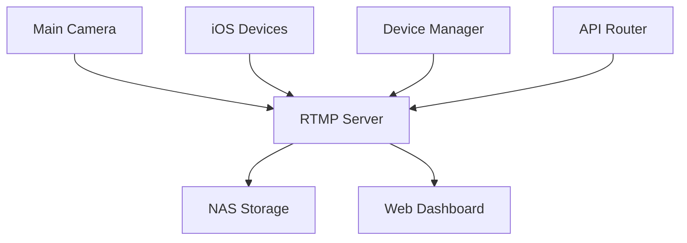

# 🎥 Cdaprod's Awesome Live Streaming Setup

[](https://github.com/Cdaprod/live-streaming-setup/actions/workflows/main.yml)
[](https://github.com/Cdaprod/live-streaming-setup/actions/workflows/security.yml)
[](https://github.com/Cdaprod/live-streaming-setup/actions/workflows/dev-setup.yml)

---


> 🚀 My ultimate local streaming command center! Bringing together pro camera gear, mobile streams, and local storage into one sleek, Dockerized package.

## ✨ What's This All About?

Ever wanted to run a professional multi-camera streaming setup from your local network? That's exactly what I built! This system handles everything from my Nikon Z7 to iOS devices, all while keeping high-quality recordings safely stored on my NAS.


### 🎮 Cool Features

- 📹 Multi-device streaming (because one camera is never enough!)
- 💾 Pristine local recordings (no quality loss here!)
- 📊 Real-time quality monitoring (catch issues before your viewers do)
- 🌐 Slick web dashboard (built with React + Tailwind)
- 🎬 Smart device management (everything just works™)
- 📦 Docker-powered (containers all the way down)

---

## 🏗 Architecture

### 🔧 The Stack



### 🎯 Core Services

- 🚀 **RTMP Server**: The streaming heart of the operation
- 🎮 **Device Manager**: Keeps everything talking nicely
- 🌐 **API Router**: Traffic control for our services (Go-powered!)
- 🖥 **Web Dashboard**: Your command center for everything


## 🚀 Getting Started

### 📋 Prerequisites

You'll need:
- 💻 Docker + Docker Compose on your laptop (`192.168.0.187`)
- 💾 NAS (`cda_ds.local`, that's `192.168.0.19` for the DNS-challenged)
- 📸 Nikon Z7 + capture card (the good stuff)
- 📱 iOS devices running Prism Live Studio (for those sweet mobile angles)

### 🏃‍♂️ Quick Start

1. **Clone this bad boy:**
 
   ```bash
   git clone https://github.com/Cdaprod/live-streaming-setup.git
   cd live-streaming-setup
   ```

2. **Set up your env (the easy way):**
 
   ```bash
   cp .example.env .env
   # Customize .env to your heart's content
   ```

3. **Launch everything:**
 
   ```bash
   docker-compose up -d
   # Grab a coffee while Docker does its thing
   ```

### 🎥 Setting Up Your Streams

#### Main Camera (The Nikon Z7 Beauty)

```yaml
Stream URL: rtmp://192.168.0.187:1935/live
Stream Key: main_camera
Quality: As high as your network can handle! (4K? Why not!)
```

#### Mobile Streams (The iOS Squad)

```yaml
Stream URL: rtmp://192.168.0.187:1935/live
Keys:
  - Main iOS: ios_main
  - B-Roll iOS: ios_secondary
```

---

## 🛠 Development & Testing

### 🧪 Running Tests

```bash
# Get your test on
pip install -r tests/requirements-test.txt
pytest tests/

# Or if you're feeling brave
pytest tests/ -v --show-capture=no
```


## 📝 Recording Management

Your streams are automatically saved to:

```
\\cda_ds.local\volume1\video\LiveStreamed-Broadcasts\
```
(Where the magic gets archived! 🎬)


## 🔍 Advanced FFmpeg Magic

Check out the separate FFmpeg configuration at:

```bash
ffmpeg-streamer/docker-compose.ffmpeg-streamer.yaml
```
> 🎩 Pro tip: This is where the real streaming wizardry happens!


## 🩺 Troubleshooting

### 🚑 When Things Go Sideways

1. **Stream Issues?**
 
   ```bash
   # Check those RTMP stats
   curl http://localhost:8080/stat
   ```

2. **NAS Acting Up?**
 
   ```bash
   # Is your NAS even mounted, bro?
   df -h | grep cda_ds.local
   ```

3. **Need the Logs?**
 
   ```bash
   # The whole shebang
   docker-compose logs -f
   ```

---

## 👋 Connect with Cdaprod

<div align="center">
  <p>
    <a href="https://youtube.com/@Cdaprod">
      
    </a>
    <a href="https://twitter.com/cdasmktcda">
      
    </a>
    <a href="https://www.linkedin.com/in/cdasmkt">
      
    </a>
    <a href="https://github.com/Cdaprod">
      
    </a>
    <a href="https://sanity.cdaprod.dev">
      
    </a>
  </p>
</div>

> 🎥 This project is part of my content creation tech stack! Watch me build and use it on [YouTube](https://youtube.com/@Cdaprod)

### 🌟 About This Project

This streaming setup powers my tech content creation across various platforms. From coding sessions to tech reviews, this is the backbone of my live streaming infrastructure. Want to see it in action? Check out my:

<div align="center">
  <p>
    <a href="https://youtube.com/@Cdaprod">📺 YouTube Channel</a> - Live coding and tech tutorials<br>
    <a href="https://twitter.com/cdasmktcda">🐦 Twitter</a> - Daily tech insights and updates<br>
    <a href="https://sanity.cdaprod.dev">📝 Blog</a> - In-depth articles and guides<br>
    <a href="https://www.linkedin.com/in/cdasmkt">💼 LinkedIn</a> - Professional updates<br>
    <a href="https://twitch.tv/cdaproductions">🎮 Twitch</a> - Live coding sessions
  </p>
</div>

<div align="center">
  <h3>🚀 Support My Work</h3>
  <p>
    <a href="https://www.buymeacoffee.com/cdaprod">
      
    </a>
    <a href="https://github.com/sponsors/Cdaprod">
      
    </a>
  </p>
  
  <p><em>Building cool stuff for developers and content creators!</em></p>
</div>

---

<div align="center">
  <p>Built with ❤️ by <a href="https://github.com/Cdaprod">Cdaprod</a></p>
  <p><em>🎬 "Because every stream deserves to be awesome!"</em></p>
</div>